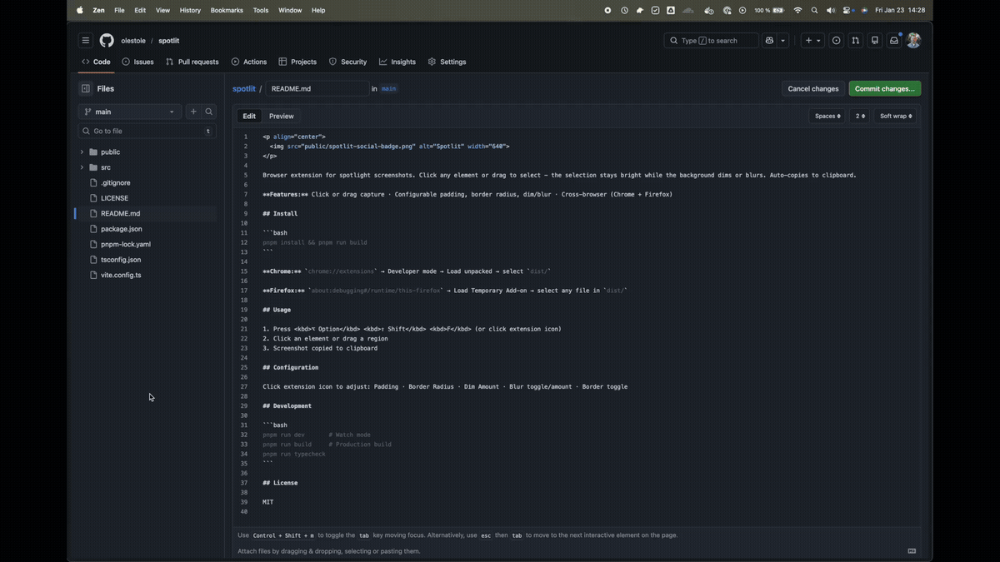

<p align="center">
  
</p>

[](https://chromewebstore.google.com/detail/cohfcdpfhgekeifhcmfplfejlmhagicp) [](https://addons.mozilla.org/en-US/firefox/addon/spotlit/) [](https://www.buymeacoffee.com/olestole)


---

Browser extension for spotlight screenshots. Click any element or drag to select - the selection stays bright while the background dims or blurs. Auto-copies to clipboard.


**Features:** Click or drag capture · Configurable padding, border radius, dim/blur · Cross-browser (Chrome + Firefox)

<p align="center">
  
</p>

---

## Usage

1. Press <kbd>⌥ Option</kbd> <kbd>⇧ Shift</kbd> <kbd>F</kbd> (or click extension icon)
2. Click an element or drag a region
3. Screenshot copied to clipboard

## Configuration

Click extension icon to adjust: Padding · Border Radius · Dim Amount · Blur toggle/amount · Border toggle

---

## Development

```bash
pnpm run dev       # Watch mode
pnpm run build     # Production build
pnpm run typecheck
```

<details>
<summary>Manual install (development)</summary>

```bash
pnpm install && pnpm run build
```

**Chrome:** `chrome://extensions` → Developer mode → Load unpacked → select `dist/`

**Firefox:** `about:debugging#/runtime/this-firefox` → Load Temporary Add-on → select any file in `dist/`
</details>

## License

MIT
